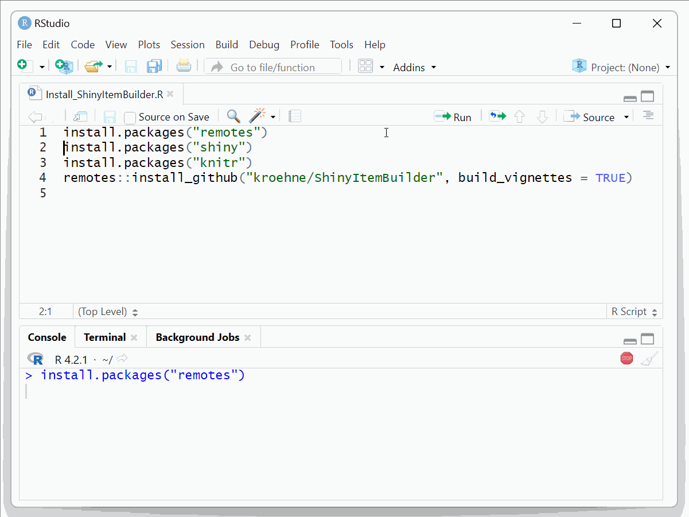
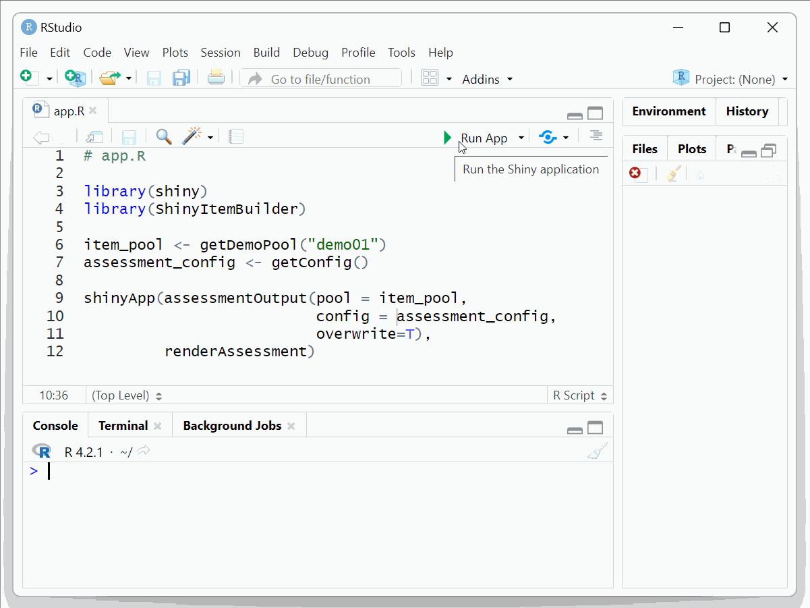

[](https://github.com/kroehne/ShinyItemBuilder/actions/workflows/R-CMD-check.yaml)

# ShinyItemBuilder -- Use Shiny with CBA ItemBuilder Items

The R project `ShinyItemBuilder` can be used to implement computer-based assessments using the [CBA ItemBuilder](https://cba.itembuilder.de) and [R](https://www.r-project.org/)/[Shiny](https://shiny.posit.co/).  

The [CBA ItemBuilder](https://cba.itembuilder.de) is an authoring tool for designing and implementing simple and complex items for computer-based assessments (CBA) that can be used without a particular knowledge in a specific programming language (such as, for instance, JavaScript). 

[R](https://www.r-project.org/)/[Shiny](https://shiny.posit.co/) is a technology to create web applications using R. Packages and functions from R can be executed on the server side. R/Shiny requires special Shiny servers, such as an account on [ShinyApps.io](https://shinyapps.io/) or a prepared server using, for instance, [ShinyProxy](https://www.shinyproxy.io/) or [Shiny Server](https://posit.co/download/shiny-server/). 

R/Shiny application can also be run locally directly from R. 

Demo: 

* Install the packages `shiny`, `remotes`, `knitr` and `ShinyItemBuilder` by executing the following lines in R:

````
install.packages("remotes")
install.packages("shiny")
install.packages("knitr")
remotes::install_github("kroehne/ShinyItemBuilder", build_vignettes = TRUE) 
````



* Run the following code in R

````
# app.R

library(shiny) 
library(ShinyItemBuilder)

item_pool <- getDemoPool("demo01")
assessment_config <- getConfig() 

shinyApp(assessmentOutput(pool = item_pool,
                          config = assessment_config,
                          overwrite=T), 
         renderAssessment)
 
````




To use your own CBA ItemBuilder-project files, create a R-Studio project, copy the CBA ItemBuilder project files into a folder `items` and run the following code in R: 

````
# app.R

library(shiny) 
library(ShinyItemBuilder)

item_pool <- getPool(path="items/")
assessment_config <- getConfig() 

shinyApp(assessmentOutput(pool = item_pool,
                          config = assessment_config,
                          overwrite=T), 
         renderAssessment)
 
````

Multiple assessment components (items, instruction pages, etc.) can be used as individual CBA ItemBuilder Project Files (and Tasks). The order can be customized in the R-object `item_pool`, or a separate function to navigate between tasks is provided as part of the `assessment_config` configuration. 

This software is currently a proof-of-concept. 

Find more information about the [CBA ItemBuilder](https://cba.itembuilder.de) at [cba.itembuilder.de](https://cba.itembuilder.de).

To see provided vignettes run in R (or open view [online](https://kroehne.github.io/ShinyItemBuilder/articles/)): 

````
browseVignettes(package="ShinyItemBuilder")
````

